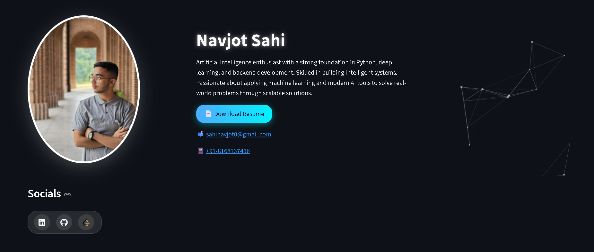

# 💼 Digital CV | Navjot Sahi

A beautifully designed, interactive digital CV and portfolio web app built using **Streamlit**, enhanced with **CSS animations**, **particles.js background**, and **custom skill cards**.

> 🚀 Live Demo: [navjotsahi.streamlit.app](https://portfolio-iya0.onrender.com/)

---

## 📌 Features

- 🧠 **About Me** section with professional summary.
- 📄 **Resume download** button.
- 👨‍💻 **Technical Skills** grouped by category (e.g., Programming, ML, Tools).
- 🛠️ **Projects** with tech stack, description, and GitHub links.
- 🎓 **Internships** & real-world contributions.
- 🌐 **Social media icons** (LinkedIn, GitHub, Leetcode).
- 🎆 **Particles.js animation** in the hero section.
- 🎨 Modern **glassmorphism UI** with gradient background and hover effects.

---

## 🛠️ Built With

- [Streamlit](https://streamlit.io/)
- [HTML/CSS](https://developer.mozilla.org/en-US/docs/Web/CSS)
- [Particles.js](https://vincentgarreau.com/particles.js/)
- [Pillow (PIL)](https://pillow.readthedocs.io/en/stable/)
- [Python 3.10+](https://www.python.org/)
- [GitHub Pages](https://pages.github.com/) or [Streamlit Community Cloud](https://streamlit.io/cloud)

---

## 🚀 Run Locally

```bash
# 1. Clone the repository
git clone https://github.com/NavjotSahi/Portfolio.git
cd Portfolio

# 2. Create a virtual environment and activate it
python -m venv venv
source venv/bin/activate  # On Windows: venv\Scripts\activate

# 3. Run the app
streamlit run app.py
```

---

## 📂 Project Structure

```
├── app.py                  # Main Streamlit app
├── profile.jpg             # Your profile picture
├── Resume_Navjot.pdf       # Downloadable resume
├── README.md               # You're here!
├── assets/
    └── leetcode.png        # Custom icon for Leetcode
    └── Screenshot.png
```

---

## 🔗 Links

- 🔗 [LinkedIn](https://www.linkedin.com/in/navjot-sahi-360470268/)
- 🔗 [GitHub](https://github.com/NavjotSahi)
- 🔗 [Leetcode](https://leetcode.com/u/NavjotSahi/)
- 📄 [Resume (PDF)](./Resume_Navjot.pdf)

---

## 📸 Screenshots

> Add screenshots of your live app if you want, for example:



---

## 🙏 Acknowledgements

- [Streamlit](https://streamlit.io)
- [Particles.js by Vincent Garreau](https://github.com/VincentGarreau/particles.js)
- [Slidesgo + CSS Glassmorphism Inspirations](https://slidesgo.com)

---

### ✨ Created with ❤️ by [Navjot Sahi](https://github.com/NavjotSahi)
